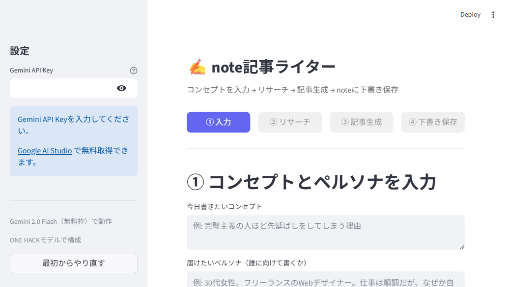

# Gemini API Key 取得・設定マニュアル

note記事ライターを使うには、Google提供の **Gemini API Key（無料）** が必要です。
このマニュアルでは、取得 → コピー → 貼り付けまでを画像付きで説明します。

- **所要時間**: 約2分
- **費用**: 完全無料（クレジットカード登録 **不要**）
- **必要なもの**: Googleアカウントのみ（Gmailを持っていればOK）

> ✅ クレジットカード登録は **完全に不要** です
> ✅ YouTube・Googleドライブ等との連携も **不要** です
> ✅ Googleアカウント（Gmail）にログインするだけで使えます

---

## 【パート1】無料APIキーの作成手順

### Step 1: Google AI Studio にアクセス

ブラウザで以下のURLを開いてください。

🔗 **https://aistudio.google.com/apikey**

Googleアカウントでログインすると、API キー管理画面が開きます。


> 初めての方は「同意する」「Dismiss」ボタンを押して画面を進めてください。

---

### Step 2: 「API キーを作成」ボタンをクリック

画面右上の **「API キーを作成」** ボタンをクリックします。


---

### Step 3: ダイアログで「キーを作成」をクリック

以下のダイアログが表示されます。


設定はそのままでOKです:
- **キー名の設定**: `Gemini API Key`（変更不要）
- **プロジェクト**: `Gemini Project`（変更不要）

右下の **「キーを作成」** ボタンをクリックすると、数秒でキーが生成されます。

---

## 【パート2】キーのコピー方法

### Step 4: 生成されたキーをコピー

作成されたキーは画面の一覧に表示されます。
キーの右側にある **コピーアイコン（四角が重なったマーク）** をクリックしてください。


> ✅ クリップボードにコピーされます（画面に「コピーしました」と表示されることも）
> ⚠️ キーは `AIza...` で始まる長い英数字です
> ⚠️ **このキーは絶対に他人に共有しないでください**

---

## 【パート3】キーの貼り付け先

### Step 5: note記事ライターのサイドバーに貼り付け

note記事ライターを開きます。

🔗 **https://note-writer.streamlit.app**

画面の左サイドバーに「Gemini API Key」という入力欄があります。
そこに **コピーしたキーを貼り付け（Ctrl+V または ⌘+V）** してください。



貼り付けると、すぐに「🔍 リサーチ開始」ボタンが押せる状態になります。

---

## 全体の流れまとめ

```
1. https://aistudio.google.com/apikey を開く
       ↓
2. 「API キーを作成」をクリック
       ↓
3. 「キーを作成」をクリック
       ↓
4. コピーアイコンでキーをコピー
       ↓
5. https://note-writer.streamlit.app のサイドバーに貼り付け
       ↓
   完了！記事生成を開始できます
```

---

## よくある質問

### Q1: 本当に無料ですか？クレジットカード登録は本当に不要？
**A: はい、完全無料です。クレジットカード登録は不要です。**

- Gemini 2.5 Flash には個人利用に十分な無料枠（1日1,500リクエスト）があります
- 必要なのはGoogleアカウント（Gmail）だけ
- 「無料枠を超えたら課金」のような仕組みではなく、**超えたら一時的に使えなくなるだけ**（翌日リセット）
- なので「気づかないうちに課金される」心配は一切ありません

### Q1-2: 無料枠だとデータがGoogleに学習で使われるって本当？
**A: 本当です。** 無料枠の制約として、入力したプロンプトと出力結果がGoogleのモデル学習に使用される可能性があります。

- note記事のコンセプトを書く程度なら気にしなくてOK
- ただし、**未公開の機密情報・顧客の個人情報・商品情報**などは入れないほうが無難
- 完全プライバシーを求めるなら有料枠（Google Cloud請求設定が必要）

### Q2: キーは毎回入力する必要がありますか？
**A: はい。** セキュリティのため、ブラウザを閉じるとリセットされます。
キーをメモ帳などに保存しておくと便利です（誰にも見られない場所に）。

### Q3: 「レート制限」「RESOURCE_EXHAUSTED」と表示されました
**A:** 無料枠には2種類の制限があります。

**① 1分あたりの制限（短期）**
- 30秒〜1分待てば再試行可能

**② 1日あたりの制限（長期）**
- ⚠️ 「Geminiの1日の無料枠を使い切りました」と表示された場合、以下のいずれかで対応:
  1. **24時間待つ** → 翌日にリセットされる
  2. **別のGoogleアカウントで新しいAPI Keyを作る**
  3. **コンセプト相談・プラン確認のステップを減らす** → 1記事あたりのAPI使用回数を減らす

> 💡 1記事生成にはおよそ5〜10回のAPI呼び出しが発生します（コンセプト提案・チャット・リサーチ・プラン・記事生成・品質チェック）。1日の無料枠は20〜250回程度なので、テスト時は使い切りやすいです。

### Q4: API Keyが無効と表示されます
**A:** 以下を確認してください:
- キーをコピペするときに余計なスペースが入っていないか
- Google AI Studio (https://aistudio.google.com/apikey) でキーが有効か
- 無効な場合は新しいキーを作り直してください

### Q5: キーが盗まれたら？
**A:** 万一キーが流出した場合は、Google AI Studio の API キー一覧から該当キーの「その他の操作」→「削除」で無効化してください。新しいキーを作り直せばOKです。

### Q6: 1日にどれくらい使えますか？
**A:** Gemini 2.5 Flashの無料枠は **1日1,500リクエスト** までです。
1記事を書くのに5〜10リクエスト程度なので、**1日150〜300記事** 書けます。
